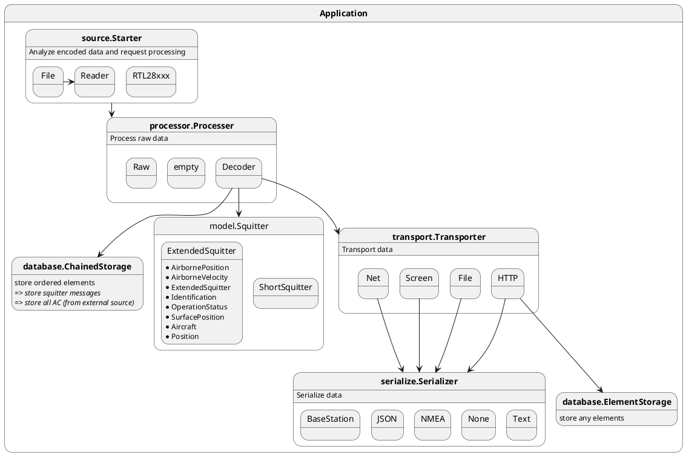

# ADSB1090

ADSB 1090 is a Mode S decoder specifically designed for RTLSDR devices.

This is a fork from the project https://github.com/antirez/dump1090 from Salvatore Sanfilippo.

The code has been cleaned to remove all net features, and has been wrapped in goland code.

This code uses:
* Leaflet: https://leafletjs.com/
* leaflet Rotated Marker: https://github.com/bbecquet/Leaflet.RotatedMarker 

## Prerequisites

* You must have a sane installation of Docker.
* Install qemu for other architecture support through docker:

```bash
sudo apt-get install -y qemu qemu-user-static
```

## Build

1. Build the drivers
2. Build the application

```bash
# Launch this command one time.
docker run --privileged --rm tonistiigi/binfmt --install all

# Build application.
make build-driver
make build-adsb1090
```

This will generate debian packages in folder `build/deb*`.

## Development

You should install Visual Studio Code (https://code.visualstudio.com/download), with extension `Dev Containers`.
Open the container and all tooling and lib will be available

## Architecture


